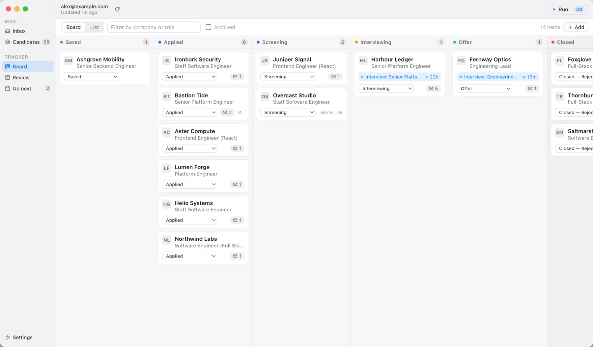
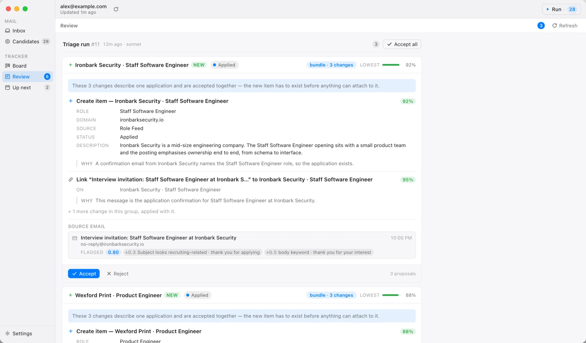
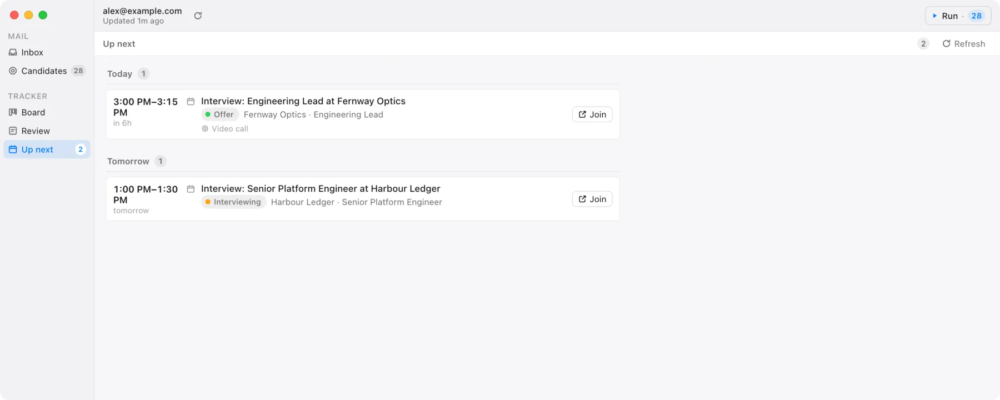

<div align="center">


# Jobbox

### Your inbox already knows. Jobbox writes it down.

Every application you send leaves a trail in your mail — the confirmation, the
recruiter's reply, the invite, the no. Jobbox reads that trail and keeps a board in step
with it. It drafts each change; you accept it.<br>**You never type the same company name
twice.**

**[Download for Mac →](https://jobbox.fline.sh)**<br>
<sub>mac app · free · no account · nothing of yours leaves your machine</sub>

</div>

<br>

<picture>
  <source media="(prefers-color-scheme: dark)" srcset="site/img/board-dark.webp">
  
</picture>

<sub>Every company, role, address and person in these screenshots is invented.</sub>

## Download

**[Jobbox for Apple Silicon](https://jobbox.fline.sh/download/mac/arm64)** · `.dmg`

**[Jobbox for Intel Mac](https://jobbox.fline.sh/download/mac/x64)** · `.dmg`

Unsigned build — macOS blocks it on first open. After you drag it to Applications:

```bash
xattr -dr com.apple.quarantine /Applications/Jobbox.app
```

## What changes

**The same board, without the data entry.**

None of this is work you weren't already doing. It's work you were doing from memory, at
half past eleven, in a spreadsheet with three tabs and one column nobody has touched
since June.

| You, by hand | Jobbox, instead |
|---|---|
| Read three thousand messages and notice the forty that are about your search. | Scores every message, flags the forty, and shows you **the phrase that flagged each one**. |
| Work out which application this mail belongs to. Scroll. Find it. Or start a new row. | Matches the mail to the application, or proposes a new one when there isn't one yet. |
| Type the company, the role, where you found it, the date you applied. | Fills in all four, out of the message that already said them. |
| Drag the card to Screening. Try to remember what made you move it. | Proposes the move with the line that justifies it attached. |
| Put the interview in your calendar. Again when it moves. Chase the one that went quiet. | Puts it in **Up next** with the time, the length and the link. |
| **Decide.** | **Not its call.** |

## How it works

**Four steps. You're needed for two.** Setup happens once; after that the loop is sync,
run, review — and review is the only one that changes anything.

**1 · Connect a mailbox** — *you.* Five minutes, once. Pick your provider, paste an
app-specific password, test the connection. Gmail, iCloud, Fastmail and anything else
that speaks IMAP. [The setup guide](https://jobbox.fline.sh/setup) has the servers, the
ports, and the one switch that causes most first-run failures.

**2 · Sync** — *Jobbox.* Pulls the last 90 days of your inbox and scores every message
against a local filter — no model, no network, just the words. Anything that looks like
your job search becomes a *candidate*, and each one keeps the reason it was picked.

**3 · Run** — *Jobbox.* The agent reads the candidates and writes out what it thinks
changed: a new application, a status move, an interview, a message filed against the
right company. Every one of them names the mail it came from. A run takes a minute or
two, and you can stop it mid-flight.

**4 · Review** — *you.* Accept or reject, one keystroke each. **Accept is the only thing
in the app that writes to your tracker.** Everything before it is a draft.

## It proposes. You decide.

<picture>
  <source media="(prefers-color-scheme: dark)" srcset="site/img/review-dark.webp">
  
</picture>

Automation you have to double-check is worse than no automation. So the rule isn't "trust
it" — it's that everything it does arrives as a change you can read in a few seconds and
throw out with one key.

- **Every proposal shows its source.** The messages that caused it, with senders, dates
  and the score that flagged them. If the reasoning doesn't hold up, you can see that
  without leaving the card.
- **Rejecting costs nothing.** There's nothing to undo, because nothing was done — the
  proposal is marked rejected and the queue moves on.
- **The agent can't reach your tracker.** It has no tool that writes one. Not a
  restricted one, not a careful one — none. Every tool it has appends a proposal and
  answers with the same sentence: *nothing has changed in the tracker yet.*
- **It can't touch your mailbox.** No sending, no replying, no deleting, no marking
  things read. Jobbox opens your mailbox to read it and closes it again.

## What it keeps

**One place where the search is actually true.** Six columns in the order a search moves.
Open a card and you get the whole history of that application — what was sent, what came
back, what got scheduled — on one thread, so *where did we leave it* takes a glance.

<picture>
  <source media="(prefers-color-scheme: dark)" srcset="site/img/upnext-dark.webp">
  
</picture>

**Up next** is everything scheduled, in time order, with a Join button on the calls that
have a link. The one screen to open on a Monday.

And the mail is still mail: Jobbox is a mail client too, so every card links back to the
actual message, unedited, the way it arrived.

## Applying, the other direction

Jobbox doesn't only read the trail — **⌘N** starts one. Paste a job description or a
link, pick a resume, and a tailor run comes back with proposed replacements against it,
each carrying the evidence that motivated it, plus a **gap list**: what the posting asks
for that your resume doesn't show. Gaps are required output, never quietly turned into
additions.

You take the changes you want, one at a time. The document is assembled locally out of
the ones you accept — never from a rewritten copy the model returned. Your cover-letter
template is adapted in the same pass, and application questions ("describe a challenge
you faced") get drafted from the resume and the posting.

Accepting renders both documents to PDF, keeps them, and files the application at
**Applied** — so the flow ends with the file you're about to upload, not just a tracker
row. Edit the resume later and those PDFs don't change: the markdown is the living
document, the stored PDF is what went out.

**Jobbox doesn't submit anything.** You still apply on the company's own site, with the
PDF it made you.

## What it needs

**Runs on your machine, under your login.** There is no Jobbox account, no Jobbox server,
and nothing of yours on anyone's disk but your own.

- **A Mac** — Apple Silicon or Intel. The database is one file in your
  application-support folder; delete it and Jobbox is gone.
- **A mailbox that speaks IMAP** — an app-specific password, not your account password.
  Jobbox keeps it in the macOS Keychain and stores only a reference in the database.
- **Claude Code or Codex, signed in** — the agent is a CLI already on your machine,
  spawned under your own login on your own subscription. Jobbox never holds an API key.
  Claude Code is the default; pick either in Settings → Agent.

## Worth saying plainly

Reading your mail with a model means the model sees the mail it reads. That's the deal,
and no privacy page changes it. What Jobbox controls is everything else: a triage run
only ever sees the messages on its own list, written to the database before the run
starts, and it gets no shell, no file access, no subagents and — on Claude Code — no web.
When it finishes, its access is revoked.

One run is a deliberate exception, and you should know about it before you use it.
**Tailoring a resume against a job link puts your resume in a run that can reach the
web.** That is an accepted risk, not a solved one: the prompt forbids fetching URLs the
posting names, but a prompt is not a sandbox. Paste job descriptions you're willing to
have a model read adversarially. The full account is in
[the engineering notes](docs/ENGINEERING.md#the-tailor-runs-exposure), including
[what each run kind can reach](docs/ENGINEERING.md#what-each-run-kind-can-reach) and a
known gap that makes this worse on Codex.

## Limits

**v1 is deliberately narrow.** Better you read this here than find it out on a Tuesday.

- **No sending.** Jobbox reads. No compose, no reply, no follow-up sent for you. Outgoing
  mail is stored and connection-tested so it can land later; nothing sends today.
- **One mailbox.** The app drives a single account. If your search runs across a personal
  address and a forwarding one, pick the one the mail actually lands in.
- **No Outlook.** Microsoft 365 and Outlook.com can't connect — Microsoft removed
  password sign-in from IMAP and Jobbox has no OAuth client yet. The preset is still in
  the form, with the warning on it, so you don't spend an evening wondering.
- **Unsigned build.** No Apple Developer certificate yet, so macOS blocks the first open
  and updates don't install themselves — the app tells you a new version exists and opens
  the download.
- **Rescheduled interviews** land as a second event instead of replacing the first.

The [longer list](docs/ENGINEERING.md#known-gaps) is honest about the rest.

## Running it from source

Requires Node >= 20.19 and either the `claude` or the `codex` CLI on your machine, signed
in.

```bash
npm install
npm run dev        # electron-vite dev — main + preload + renderer with HMR
```

```bash
npm run build      # -> out/main, out/preload, out/renderer
npm run typecheck  # tsc --noEmit
npm test           # vitest — pure functions only, by design
npm run dist:mac   # DMG + ZIP into release/
```

## Docs

- **[docs/ENGINEERING.md](docs/ENGINEERING.md)** — how it's built, what each agent run
  can reach, the sandboxing, the known gaps, releasing.
- **[site/](site/)** — the landing page and the per-provider setup guide at
  [jobbox.fline.sh](https://jobbox.fline.sh).
- **[server/README.md](server/README.md)** — the Go update service.

## License

See [LICENSE](LICENSE).
